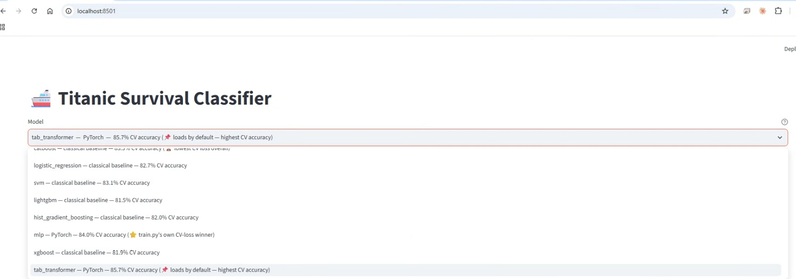
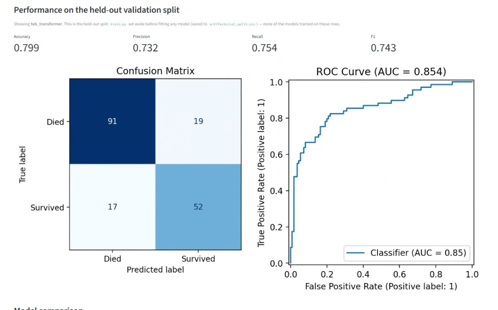
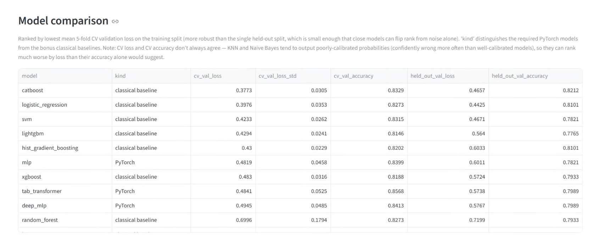
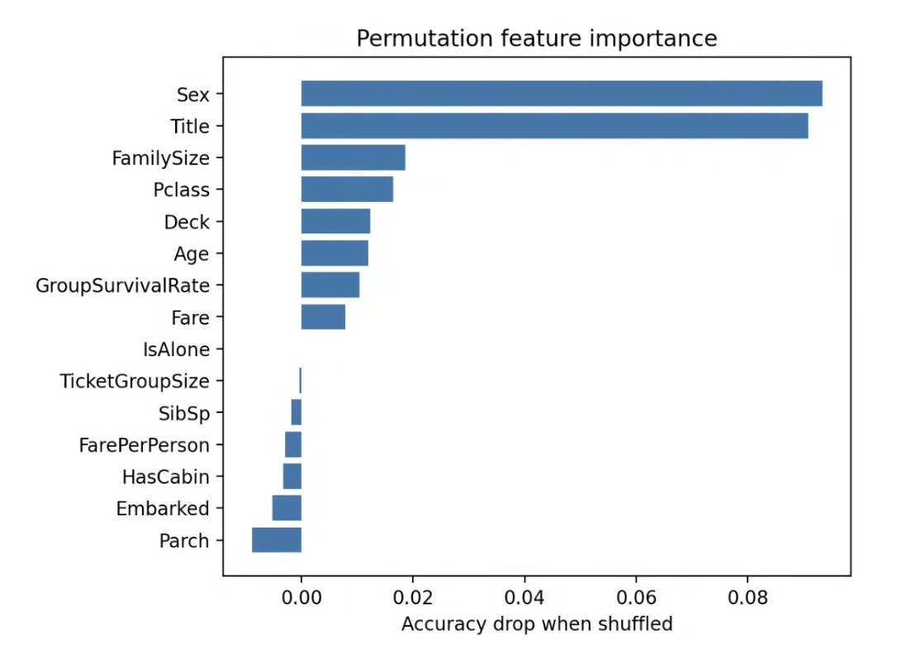
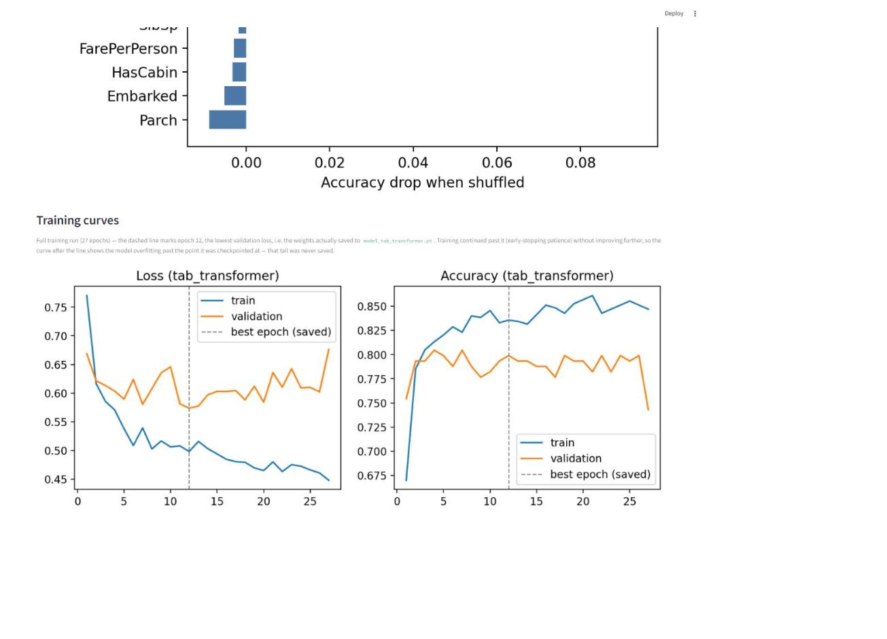
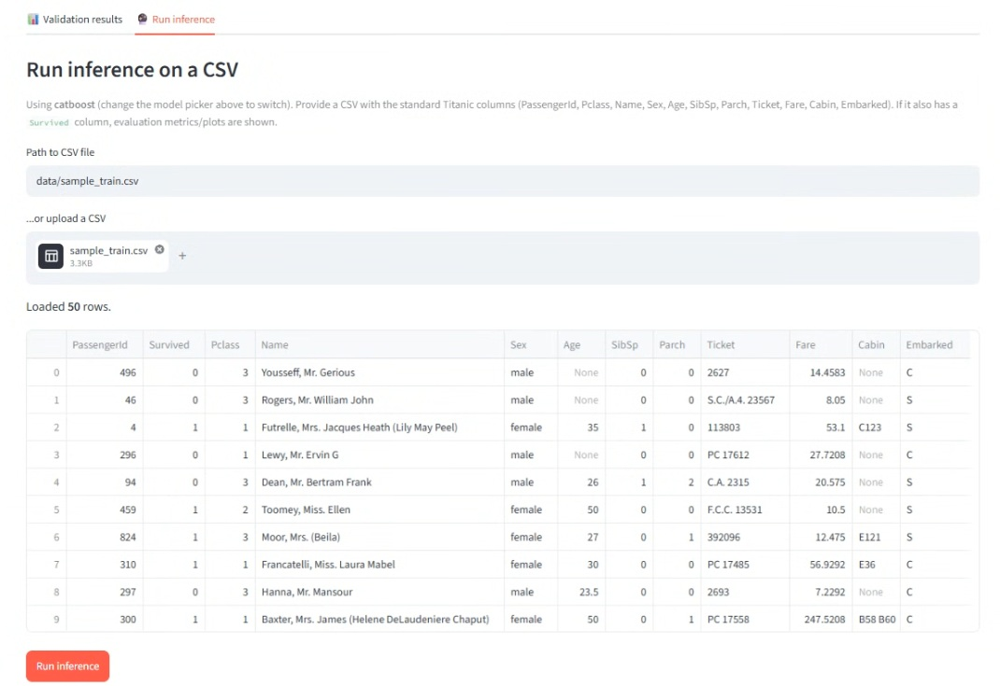
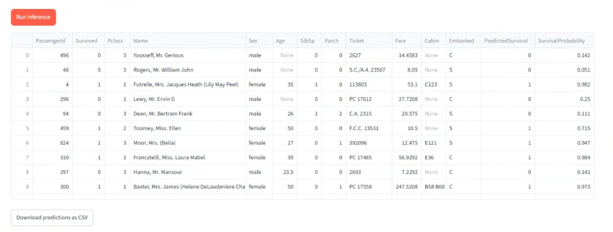
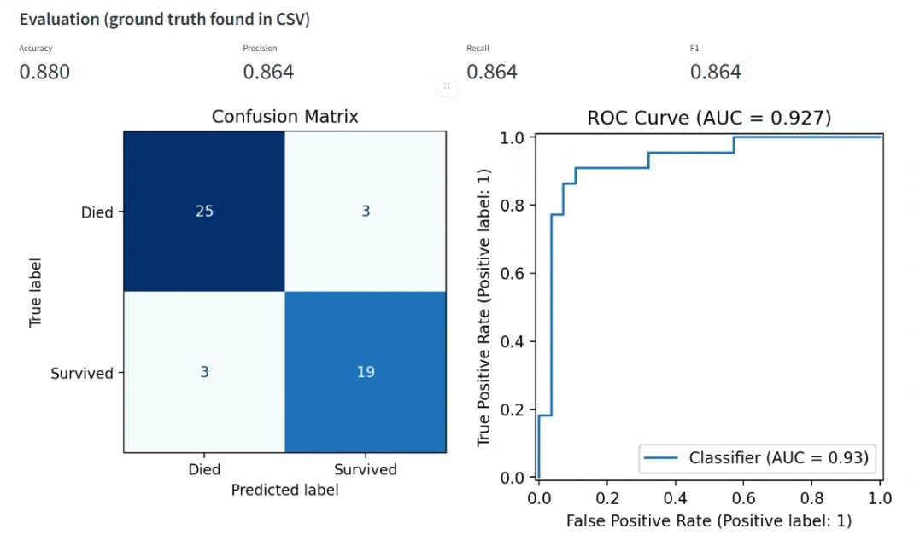

# Titanic Survival Classifier

Data Science home assignment — end-to-end classification pipeline (EDA →
PyTorch training script → Streamlit evaluation/inference app) on the
[Kaggle Titanic dataset](https://www.kaggle.com/competitions/titanic/data).

## Architecture & design choices

```
.
├── data/
│   ├── fetch_data.py       # pulls train.csv from Kaggle via the official API
│   └── sample_train.csv    # small (50-row) sample committed to the repo
├── notebooks/
│   ├── eda.ipynb            # exploratory data analysis
│   └── model_benchmark.ipynb # bonus: PyTorch archs vs. classic SOTA baselines
├── src/
│   ├── __init__.py          # makes src a regular package (avoids shadowing
│   │                          # by any same-named package on sys.path)
│   ├── preprocessing.py     # TitanicPreprocessor / TitanicTokenizer: shared
│   │                          # feature engineering
│   ├── model.py              # TitanicNet (MLP) + TabTransformerNet
│   ├── architectures.py      # registry: arch name -> preprocessor/model/forward
│   └── importance.py         # permutation feature importance (model-agnostic)
├── train.py                  # standalone training + architecture-comparison script
├── train_baselines.py        # bonus, non-graded: classical scikit-learn-API baselines
├── ds_app.py                 # Streamlit app: model picker + validation results + inference UI
├── requirements.txt
└── artifacts/                 # created by train.py/train_baselines.py (gitignored):
                                # model_<name>.pt|.pkl + preprocessor_<name>.pkl per
                                # model, val_split.csv, history.json,
                                # model_comparison.json / baseline_comparison.json,
                                # feature_importance.json / baseline_feature_importance.json
```

**Why a shared preprocessor.** The exact same feature engineering and fitted
scalers/encoders have to be used at training and inference time, or the model
silently sees a different feature distribution than it was trained on.
`src/preprocessing.py` is imported by both `train.py` (fit + transform) and
`ds_app.py` (transform-only, loaded from a pickle), so there is a single
source of truth. It exposes two classes built on the same engineered
features:
- `TitanicPreprocessor` — impute + scale/one-hot into one flat feature
  vector, for the MLP architectures.
- `TitanicTokenizer` — the same features kept as separate per-column tokens
  (scaled numerics, ordinal-encoded categoricals), for the TabTransformer.

**Feature engineering** (see `notebooks/eda.ipynb` for the analysis behind
each choice):
- `Title` extracted from `Name` (Mr/Mrs/Miss/Master/Rare) — captures
  age/gender/class signal `Name` itself can't be used for directly.
- `FamilySize = SibSp + Parch + 1`, `IsAlone` — survival is non-monotonic in
  raw `SibSp`/`Parch` but has a cleaner U-shape in total family size.
- `HasCabin` / `Deck` — a presence flag plus the cabin letter, rather than
  the raw (77%-missing) `Cabin` string. The single-passenger `"T"` deck is
  folded into `"A"` (its closest real analog) so it isn't a near-unique
  one-hot column that's pure noise for the model. A missing-cabin passenger's
  `Deck` is also recovered from a ticket-mate whose cabin *is* known before
  falling back to `"U"` (people sharing a ticket typically shared a cabin) —
  a small effect (11 of 891 rows) but free and leakage-safe, since it only
  ever looks at `Ticket`/`Cabin` within whichever rows are being processed.
- `TicketGroupSize` / `FarePerPerson` — people sharing a ticket number are a
  travel party; the raw `Fare` is the *party's* fare, so dividing by party
  size gives a per-person price comparable across parties.
- `GroupSurvivalRate` — the single most informative engineered feature
  (commonly used in top Titanic solutions): passengers traveling together
  (same surname + ticket) tend to share the same fate. Computed
  **leakage-safe**: each training row gets its *leave-one-out* group rate
  (excluding its own label), and validation/inference rows look up their
  group's train-derived rate, falling back to the global training rate for
  unseen groups (`src/preprocessing.py::_GroupSurvivalEncoder`).
- **Age imputation by Title, not one global median.** ~20% of `Age` is
  missing, and age varies hugely by `Title` (`Master` ≈ 3.5 vs. `Mr` ≈ 30 vs.
  a single dataset-wide median of 28 for everyone) — imputing with the
  global median badly distorts exactly the rows where `Title` already tells
  us a lot about age. `_TitleAgeImputer` fits per-Title medians on the
  training split only and falls back to the training set's global median
  for any unseen Title (`src/preprocessing.py::_TitleAgeImputer`).
- `PassengerId`, `Name`, `Ticket`, and raw `Cabin` are dropped as either
  identifiers or too sparse to use directly (after being mined for the
  features above).
- Everything is **fit only on the training split** to avoid leakage into
  validation.

**Models — three PyTorch architectures, compared via cross-validation.**
`train.py` trains all three, then keeps the one CV likes best (see below) —
but all three are always saved, and `ds_app.py`'s model picker lets you
inspect/run any of them.

*`mlp` and `deep_mlp`* are the same class (`src/model.py::TitanicNet`), just
instantiated with different `hidden_sizes` — one architecture, two capacity
settings, so they're directly comparable with nothing else changing:

```python
class TitanicNet(nn.Module):
    def __init__(self, n_features, hidden_sizes=(32, 16), dropout=0.3):
        # stack of Linear -> ReLU -> Dropout blocks, ending in one
        # un-activated logit (BCEWithLogitsLoss applies sigmoid internally)
```
- `mlp`: `hidden_sizes=(32, 16)` — input (33 features after one-hot) → 32 → 16 → 1.
- `deep_mlp`: `hidden_sizes=(64, 32, 16)` — one extra layer, roughly double
  the first-layer width.

With only ~33 features over ~700 training rows, `32→16` was picked as
"enough capacity to find nonlinear feature interactions (e.g. `Sex` ×
`Pclass`) without wildly overparameterizing." `deep_mlp` exists to actually
*test* whether more capacity helps rather than assuming it does — and per
the CV results it barely does (84.1% vs. `mlp`'s 84.0% CV accuracy),
evidence the smaller model already has enough capacity for this problem.
**Dropout 0.3** (fairly aggressive — the risk here is overfitting 700 rows,
not underfitting) plus **weight decay** on Adam and **early stopping** on
validation loss round out the regularization.

*`tab_transformer`* (`src/model.py::TabTransformerNet`) is structurally
different: instead of concatenating every feature into one flat vector, it
treats each *feature* as a token in a sequence, the way a Transformer treats
each word in a sentence, and lets self-attention learn which features
matter jointly rather than hand-designing interaction terms.
1. **Tokenize every column individually.** Each numeric feature (`Age`,
   `Fare`, `GroupSurvivalRate`, ...) gets its own `nn.Linear(1, d_model)` —
   a dedicated learned projection from a single scalar up to a
   `d_model`-dim vector. Each categorical feature (`Sex`, `Title`, `Deck`,
   ...) gets its own `nn.Embedding(cardinality, d_model)`. This is why the
   app needs `TitanicTokenizer` instead of `TitanicPreprocessor` for this
   architecture — numerics stay as separate scaled scalars and categoricals
   stay as separate integer indices, rather than being flattened/one-hot
   encoded, so each column can be tokenized on its own.
2. **Prepend a learnable `[CLS]` token** (borrowed from BERT) and run the
   full sequence through `nn.TransformerEncoder` (`d_model=32`, `n_heads=4`,
   `n_layers=2`, `dim_feedforward=4×d_model` — deliberately small: a
   standard NLP Transformer has hundreds of dimensions and dozens of
   layers, but here there are only ~20 "words" (features) per "sentence"
   (row) and ~700 sentences total, so anything larger would overfit
   immediately). `[CLS]` has no feature of its own; it attends over every
   real feature token and ends up holding a pooled, attention-weighted
   summary of the whole row.
3. **Classify from the `[CLS]` output**: `LayerNorm → Dropout(0.2) →
   Linear(d_model, 1)` → one logit, same convention as the MLPs.

The docstring on `TabTransformerNet` is explicit that it's included "as a
genuine architecture comparison, not because it's expected to dominate" —
attention over ~20 tokens is a lot of capacity for 700 rows. The actual
result is genuinely interesting anyway: it comes out with the **highest CV
accuracy of all 12 models** in this project (85.7%), PyTorch or classical
baseline, though `mlp` still wins on CV *loss* by a hair (see below for why
that's the metric `train.py` optimizes for). See
`notebooks/model_benchmark.ipynb`'s takeaways for why this one result
shouldn't be read as "transformers beat gradient boosting on small tabular
data" as a general claim.

All three are trained with `BCEWithLogitsLoss` using a `pos_weight` to
correct for the ~62/38 class imbalance, Adam with weight decay, and early
stopping on validation loss.

**Why cross-validation for architecture selection.** With only ~700
training rows, a single 80/20 split is noisy enough that two close
architectures can flip rank depending on which rows happen to land in
validation — early iterations of this project picked a "winner" by a
val-loss margin of 0.004, which is noise, not signal. `train.py` now runs
**5-fold stratified cross-validation on the training split** (`--cv-folds`,
default 5) for each architecture and picks the one with the lowest mean CV
validation loss. The single held-out split (below) is still what's kept
untouched throughout — CV only ever sees the training portion — and is what
gets reported as the final, assignment-required validation metric.

**Evaluation.** `train.py` holds out a stratified validation split
(`--val-size`, default 20%) *before* fitting or cross-validating anything,
and saves it to `artifacts/val_split.csv` so the Streamlit app can score the
trained model on data it never saw. It also saves
`artifacts/model_comparison.json` (both the CV mean±std and the held-out
split's loss/accuracy, for every architecture tried) and
`artifacts/feature_importance.json` (permutation importance of the winner —
see below). The app reports accuracy/precision/recall/F1, a confusion
matrix, an ROC curve, the architecture comparison table, a feature
importance chart, and training curves.

**Training curves show only the checkpoint that was actually saved.**
`tab_transformer` in particular visibly overfits if you let it train long
enough — training loss keeps dropping while validation loss plateaus/rises.
That's expected (attention over ~20 tokens is a lot of capacity for ~700
rows) and early stopping (`--patience`, default 15 epochs) already handles
it correctly: `run_training()` only updates its saved `best_state` when
validation loss *improves*, so the weights that ship in `model_<arch>.pt`
come from whichever epoch had the lowest validation loss, not the final
epoch. The app's training-curve plot mirrors this — it's truncated to that
best epoch (with a dashed vertical line marking it), rather than plotting
the full run including the post-overfitting patience window, so the chart
shown matches what was actually deployed instead of implying the model rode
out the whole overfitting tail.

**Feature importance.** `src/importance.py` computes **permutation
importance** for the winning model, whichever architecture it is: each
engineered feature is shuffled in the validation set and the resulting drop
in accuracy is measured (averaged over repeats). This works identically
regardless of architecture — no gradients or model-specific internals
needed — which matters here since the winner can be the MLP or the
Transformer depending on the run.

**Benchmarking against classic SOTA baselines.**
`notebooks/model_benchmark.ipynb` (interactive, with plots/discussion) and
`train_baselines.py` (standalone script that persists the models as
artifacts) both train a broad spread of classic baselines — Logistic
Regression, KNN, Naive Bayes, SVM, Random Forest, HistGradientBoosting,
XGBoost, LightGBM, and CatBoost — on the *same* train/val split, feature
engineering, and 5-fold CV as `train.py`, for context on how the PyTorch
models compare to strong (and not-so-strong) classical tabular baselines.
**Both are bonus and non-graded** — the assignment's required deliverable
is `train.py`'s PyTorch model, which is always one of `mlp` / `deep_mlp` /
`tab_transformer`. Run `python train_baselines.py` (after `train.py`) and
`ds_app.py`'s model picker will show every baseline alongside the PyTorch
architectures, clearly labeled by kind, with a PyTorch model (`tab_transformer`)
still pre-selected by default regardless of whether a baseline scores lower.

## Setup

```bash
git clone https://github.com/elichensaips/titanic_assigment.git
cd titanic_assigment
python -m venv .venv && source .venv/bin/activate   # optional but recommended
pip install -r requirements.txt
```

## Getting the data

The assignment requires fetching `train.csv` directly from Kaggle:

```bash
# 1. Get Kaggle API credentials: kaggle.com -> Account -> Settings -> API
#    Either "Create New Token" (saves kaggle.json - place at ~/.kaggle/kaggle.json)
#    or use the newer access-token flow (save the token to ~/.kaggle/access_token).
# 2. Accept the competition rules (required by Kaggle for any download):
#    https://www.kaggle.com/competitions/titanic/rules
# 3. Fetch:
python data/fetch_data.py
```

This saves `data/train.csv`. If you don't have Kaggle credentials handy,
`data/sample_train.csv` (50 rows) is included in the repo so the code can
still be inspected/run end-to-end — just pass `--data data/sample_train.csv`
to `train.py` (results will be noisier with that few rows).

## Run

**1. Train the model:**
```bash
python train.py
# optional flags: --data data/train.csv --epochs 100 --val-size 0.2 --batch-size 32 --lr 1e-3
# --archs mlp,deep_mlp,tab_transformer   (comma-separated subset to train/compare)
```
This writes, per architecture, `artifacts/model_<arch>.pt` (weights +
metadata) and `artifacts/preprocessor_<arch>.pkl`, plus the shared
`artifacts/val_split.csv`, `artifacts/history.json`,
`artifacts/model_comparison.json`, and `artifacts/feature_importance.json`.

**2. (Optional, bonus) Train the classical baselines:**
```bash
python train_baselines.py
```
Trains Logistic Regression, KNN, Naive Bayes, SVM, Random Forest,
HistGradientBoosting, XGBoost, LightGBM, and CatBoost on the identical
split, and writes `artifacts/model_<name>.pkl` per baseline, a shared
`artifacts/preprocessor_baselines.pkl`, `artifacts/baseline_comparison.json`,
and `artifacts/baseline_feature_importance.json`. Skip this step and
everything still works — the app just won't show the baselines.

**3. Launch the app:**
```bash
streamlit run ds_app.py
```
- **Model picker** — a dropdown above the tabs lists every model found in
  `artifacts/` (the 3 required PyTorch architectures, plus any classical
  baselines from step 2), labeled with kind and CV accuracy. 📌
  `tab_transformer` is pre-selected by default (highest CV accuracy overall);
  ⭐ marks `train.py`'s own pick instead (lowest CV loss among just the 3
  PyTorch architectures — currently `mlp`); 🏆 marks whichever model has the
  lowest CV loss overall, if that's a different (baseline) model.
- **Validation results tab** — metrics/plots on the held-out split for the
  selected model, the full model comparison table, permutation feature
  importance, and training curves (PyTorch models only — classical
  baselines aren't trained iteratively), read straight from `artifacts/`.
- **Run inference tab** — point at any CSV with the Titanic schema (a file
  path or an upload) and run it through the selected model. If the CSV has
  a `Survived` column, evaluation plots are shown too; otherwise you just
  get predictions + a download button. Try it against `data/sample_train.csv`.

**4. Explore the notebooks:**
```bash
jupyter notebook notebooks/eda.ipynb              # exploratory data analysis
jupyter notebook notebooks/model_benchmark.ipynb  # bonus SOTA baseline comparison
```

## Example usage

- Train: `python train.py` → for each architecture, runs 5-fold CV on the
  training split, then trains once more on the full train/val split for the
  final artifacts. Verified run on the full Kaggle `train.csv` (712 train /
  179 validation rows), after Title-based Age imputation, the Deck T→A
  merge, and Deck ticket-mate recovery (all measurably improved every
  model's CV accuracy vs. the original global-median-imputation run):

| architecture | 5-fold CV accuracy | CV val loss | held-out split accuracy |
|---|---|---|---|
| `mlp` | 84.0% ± 2.4% | **0.4819** (winner) | 78.2% |
| `deep_mlp` | 84.1% ± 2.5% | 0.4945 | 79.9% |
| `tab_transformer` | **85.7% ± 1.7%** (highest accuracy) | 0.4841 | 79.9% |

  `train.py` picks the winner by lowest mean **CV loss**, not highest CV
  accuracy — loss reflects prediction confidence/calibration, not just which
  side of 0.5 a prediction lands on, and it's the metric each model was
  actually trained to minimize. Here that means `mlp` wins even though
  `tab_transformer` has the highest CV accuracy; see the benchmark
  notebook's takeaways for why this is a deliberate, principled choice
  rather than a quirk.
- Benchmark notebook: on the same 5-fold CV, the strongest classical
  baseline was **CatBoost at 84.6%** — between the winning `mlp`/`deep_mlp`
  (~84%) and `tab_transformer` (85.7%). SVM, Random Forest, and Logistic
  Regression form a tight middle tier (~83%); KNN (82.6%) and XGBoost
  (81.0%) trail further; **Naive Bayes is weakest (79.1%)** — its
  feature-independence assumption doesn't hold well here since several
  engineered features are deliberately correlated by construction (e.g.
  `Fare`/`FarePerPerson`/`Pclass`). For reference, a well-known public
  Titanic tutorial (KNN/DecisionTree/RandomForest/NaiveBayes/SVM with
  hand-binned features) reports 83.5% via SVM as its best score — on our
  feature engineering, SVM lands similarly (83.3%), but CatBoost and every
  PyTorch architecture here beat it. See the notebook's takeaways for the
  full ranking and discussion.
- Top permutation-importance features for the winning model: `Title`, `Sex`,
  `FamilySize`, `Age`, `GroupSurvivalRate` — `Age` now shows up in the top 5
  (it didn't before the Title-based imputation fix). `eda.ipynb`'s Cramér's V
  analysis (Section 5b — a model-free, purely statistical association
  measure) independently ranks `Title`/`Sex` highest among categorical
  features too, agreeing with the model-based importance despite being a
  completely different method — consistent with the "women, children, and
  travel-party fate" signal both identify.
- Baselines: `python train_baselines.py` → verified run, ranked by 5-fold CV
  loss (lower is better): **CatBoost 0.377** (lowest overall), Logistic
  Regression 0.398, SVM 0.423, LightGBM 0.429, HistGradientBoosting 0.430 —
  all five beat every PyTorch architecture's CV loss (`mlp` 0.482,
  `tab_transformer` 0.484, `deep_mlp` 0.495) — then XGBoost 0.483, Random
  Forest 0.700, and KNN (1.97) / Naive Bayes (2.11) far behind. That last
  pair's *accuracy* is respectable (81.5% / 78.8%) despite the terrible
  loss — both output poorly-calibrated probabilities (confidently wrong
  more often than they should be), which log loss punishes hard but plain
  accuracy doesn't notice. In `ds_app.py`, `tab_transformer` loads by
  default (highest CV accuracy overall, and still one of the 3 required
  PyTorch architectures) even though CatBoost scores lower CV loss —
  `train.py`'s own pick (`mlp`, by lowest CV loss among just the PyTorch
  architectures) and CatBoost's result are both fully visible in the app's
  comparison table and selectable, just not what auto-loads.
- App: `streamlit run ds_app.py` → opens at `http://localhost:8501` with a
  model picker (12 models once both training scripts have been run) plus
  the two tabs described above. Verified end-to-end against
  `data/sample_train.csv` for every model (84-94% accuracy on that 50-row
  sample, depending on which model is selected).

### Screenshots

*Reminder, since it comes up in these screenshots: `train.py`'s own pick
(lowest CV loss among the 3 required PyTorch architectures) is `mlp`, but
the app's default selection — what loads first, shown below — is
`tab_transformer`, because it has the highest CV accuracy of all 12 models.
Both are intentional, separate picks (📌 vs. ⭐ in the model picker), not a
contradiction — see "Models" above for the full reasoning.*

**Model picker — every model, labeled by kind and CV accuracy**


**Validation results — default model (`tab_transformer`)**


**Model comparison table — ranked by CV loss**


**Permutation feature importance**


**Training curves — truncated to the saved checkpoint**


**Run inference tab — CatBoost selected, CSV loaded**


**Inference predictions + download button**


**Inference evaluation — ground truth found in the CSV**


## Reproducibility notes

- Random seed fixed (`--seed`, default 42) for the train/val split, model
  init, and training — and reset before training each architecture, so the
  comparison isn't confounded by different random states.
- Validation split is stratified on `Survived` to keep class balance
  consistent between train/val.
- `GroupSurvivalRate` is fit only on the training split and looked up
  (never recomputed with validation/inference labels) at transform time —
  no target leakage across the train/val boundary.
- `artifacts/` is gitignored — it's regenerated by `train.py`, not checked
  in, so the repo doesn't ship stale weights.
